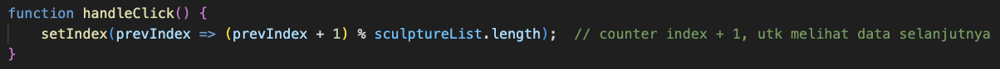
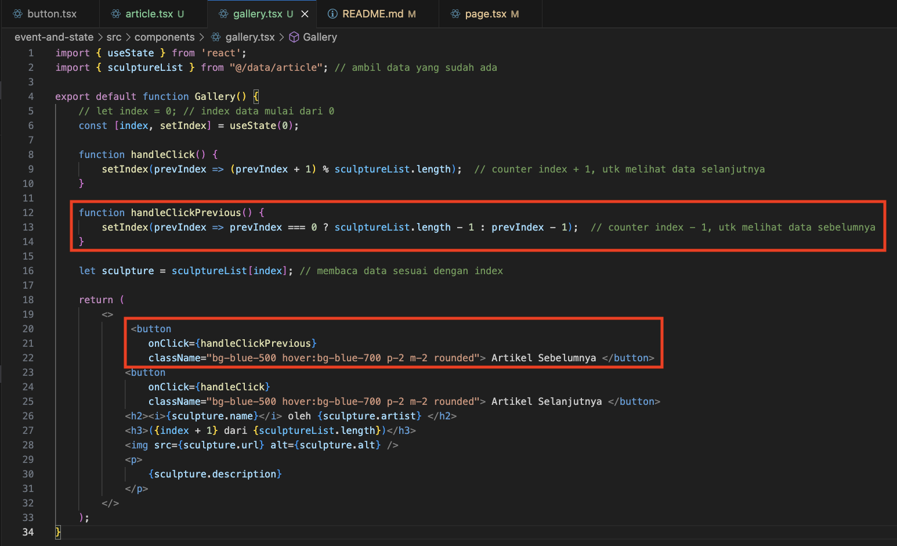

|  | Pemrograman Berbasis Framework 2024 |
|--|--|
| NIM |  2141720135 |
| Nama |  Mutiara Devita Eka Putri |
| Kelas | TI - 3A |

1. Jika kita menekan tombol "Artikel Selanjutnya" sebanyak 5x (atau melebihi halaman total artikel), apa yang akan terjadi?
- *Jawab* : Jika kita menekan tombol sebanyak 5x maka akan menuju kehalaman artikel selanjutnya tetapi jika melebihi halaman total arikel maka terjadi error.

2. Modifikasilah gallery.tsx agar bisa meng-handle permasalahan tersebut.
*jawab* : Modifikasi dilakukan pada bagian function handleClick yang sebelumnya
 menjadi

3. Tambahkan tombol "Artikel Sebelumnya", untuk menampilkan artikel secara mundur.

