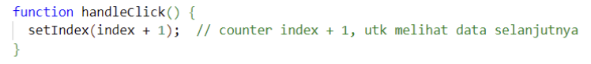

|  | Pemrograman Berbasis Framework 2024 |
|--|--|
| NIM |  2141720135 |
| Nama |  Mutiara Devita Eka Putri |
| Kelas | TI - 3A |

1. Jika kita menekan tombol "Artikel Selanjutnya" sebanyak 5x (atau melebihi halaman total artikel), apa yang akan terjadi?
- *Jawab* : Jika kita menekan tombol sebanyak 5x maka akan menuju kehalaman artikel selanjutnya tetapi jika melebihi halaman total arikel maka terjadi error.

2. Modifikasilah gallery.tsx agar bisa meng-handle permasalahan tersebut.
*jawab* : Modifikasi dilakukan pada bagian function handleClick yang sebelumnya
 menjadi

3. Tambahkan tombol "Artikel Sebelumnya", untuk menampilkan artikel secara mundur.

4. Jalankan pada browser, amati dan laporkan apa yang terjadi?

*Jawab* : Jika jawaban benar maka akan tampil pesan bahwa jawaban benar begitupun jika jawaban salah maka akan terdapat pesan error bahwa jawaban salah.

5. Apa perbedaan dari fungsi Form_2 yang pertama dengan yang kedua?

 *jawab* : 
- Pada Form_2 yang Pertama fungsi handleFirstNameChange dan handleLastNameChange mengabaikan nilai terbaru dari input nama belakang atau depan saat memperbarui fullName. Ini mengakibatkan fullName selalu menyertakan nilai sebelumnya dari input yang tidak berubah. Contoh: Jika kita mengubah input nama depan, tetapi input nama belakang tetap sama, fullName akan tetap memiliki nilai sebelumnya dari gabungan nama depan dan belakang.
- Pada Form_2 yang Kedua handleFirstNameChange dan handleLastNameChange memperbarui fullName dengan memeriksa kedua input nama depan dan belakang. Jika keduanya tidak kosong, maka fullName akan diperbarui dengan gabungan nama depan dan belakang yang baru. Jika salah satu di antaranya kosong, maka fullName akan diatur menjadi nilai dari input yang tidak kosong.

6. Kenapa perlu menghapus state fullName? Apa keuntungannya?

*jawab* : Kita tidak benar-benar menghapus state fullName. Sebaliknya, kita memperbarui nilai fullName secara dinamis berdasarkan nilai terbaru dari input nama depan dan belakang. Keuntungan dari pendekatan ini adalah kita menghindari kebutuhan untuk memiliki state tambahan yang sebenarnya tidak perlu. Sebagai gantinya, kita mengandalkan state firstName dan lastName yang sudah ada, dan fullName hanya berfungsi sebagai hasil gabungan dari keduanya.

7. Apa tujuan dari penulisan ini key={to.email} pada < Chat key={to.email} contact={to} / > ?

*jawab* : Penulisan key={to.email} pada elemen <Chat key={to.email} contact={to} /> adalah untuk memberikan identitas unik kepada setiap elemen dalam daftar. Properti key digunakan oleh React untuk membantu dalam proses penciptaan, pembaruan, dan penghapusan elemen dalam daftar.

8. Apa fungsi dari props key tersebut?

*jawab* : Fungsi dari properti key adalah sebagai berikut:

- Meningkatkan Efisiensi Render: Ketika ada perubahan dalam daftar elemen, React menggunakan properti key untuk mengidentifikasi perubahan mana yang terjadi. Dengan demikian, React dapat memperbarui hanya elemen-elemen yang berubah, tanpa perlu merender ulang seluruh daftar.

- Mengidentifikasi Elemen: Properti key membantu React dalam mengidentifikasi elemen-elemen dalam daftar secara unik. Ini membantu React membedakan antara elemen yang berbeda dan mengelola mereka dengan benar selama proses render.

- Pengoptimalan Re-render: Properti key membantu React dalam menentukan apakah suatu elemen telah diubah, ditambahkan, atau dihapus dari daftar. Dengan menggunakan key, React dapat memutuskan cara terbaik untuk mengoptimalkan proses re-render, menghasilkan kinerja yang lebih baik.